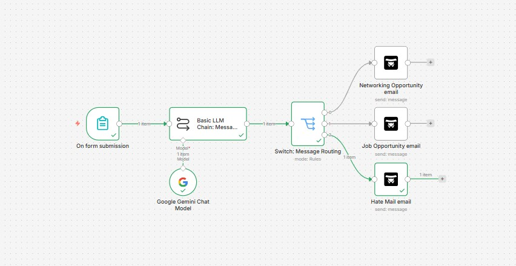

## Workflow Overview

# AI-Agent-Inquiry-Routing-System
AI-powered contact form routing workflow built with n8n and Gemini. Automatically classifies inbound inquiries using natural-language understanding, replacing rigid keyword matching to route messages to the appropriate destination.
The project was created to explore practical applications of workflow automation, AI-assisted decision-making, and business process optimization.

Problem

Traditional contact forms often require manual review of incoming messages or complex keyword-based routing rules. These approaches can be time-consuming, difficult to maintain, and prone to misclassification when users phrase requests in unexpected ways.

This workflow addresses that challenge by using natural-language classification to understand the intent behind each submission and route it accordingly.

Solution

The workflow accepts contact form submissions and sends the message content to Gemini for classification. Based on the AI-generated category, a Switch node routes the submission to the appropriate email destination.

Supported Categories
Job Opportunities
Networking Inquiries
Spam / Inappropriate Messages
Workflow Architecture

Contact Form Submission
→ Gemini AI Classification
→ Switch Routing Logic
→ Category-Specific Email Delivery

Technologies Used
n8n
Gemini API
AI Prompt Engineering
Conditional Routing Logic
Email Automation - Agent Mail
Key Features
AI-powered message classification
Automated email routing
Natural-language understanding
Reduced dependence on keyword matching
Modular workflow design for future expansion
Learning Outcomes

Through this project, I gained hands-on experience with:

Workflow automation design
AI API integration
Prompt engineering
Conditional logic and routing
Process optimization and automation strategy
Future Enhancements

Potential improvements include:

Additional inquiry categories
CRM integration
Contact logging to Google Sheets or a database
Confidence scoring and classification auditing
Automated response generation
Multi-step AI agent workflows
Author

Kyle Zambrano

Healthcare Management Graduate with interests in workflow automation, AI-enabled business processes, healthcare operations, and process improvement.
